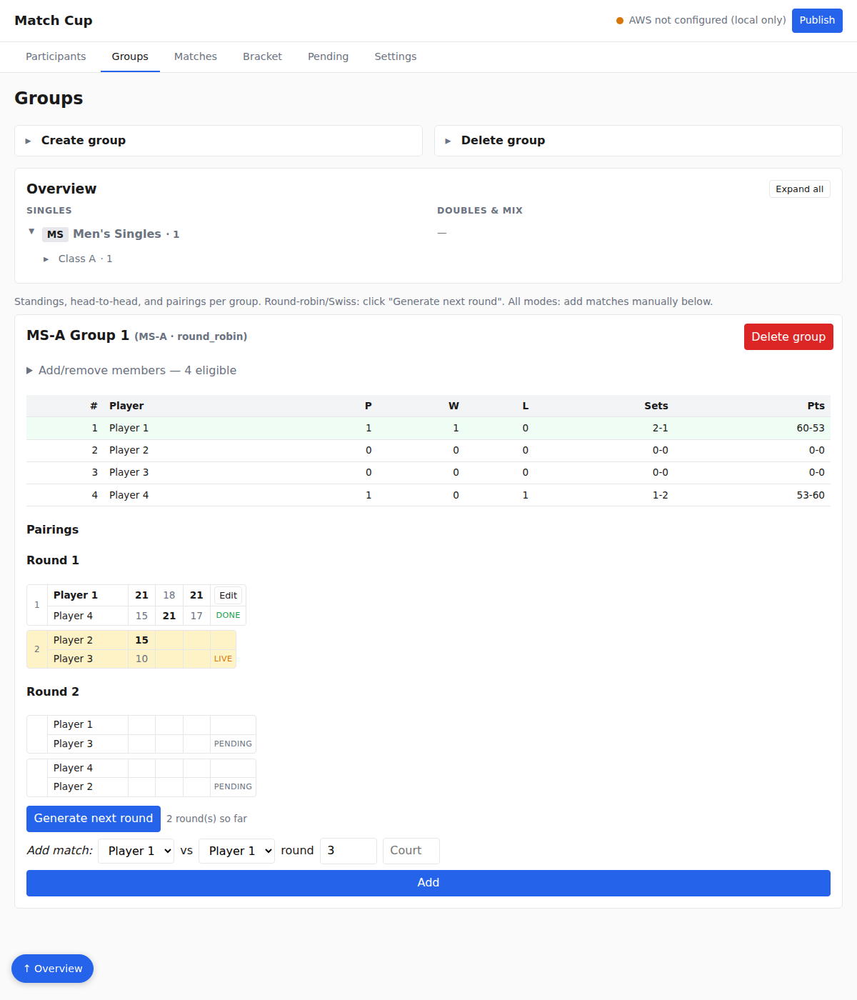
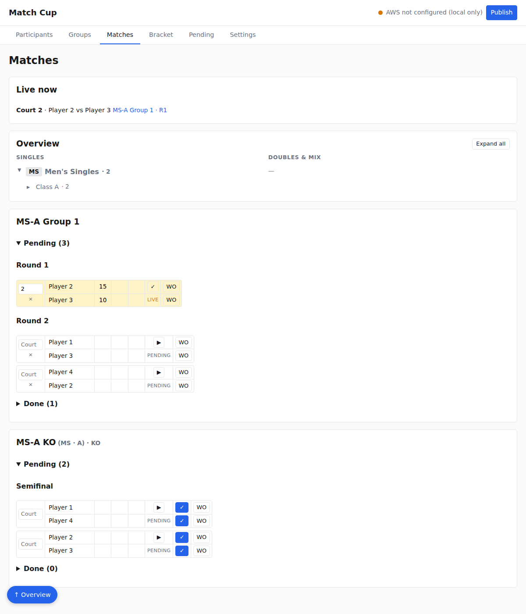
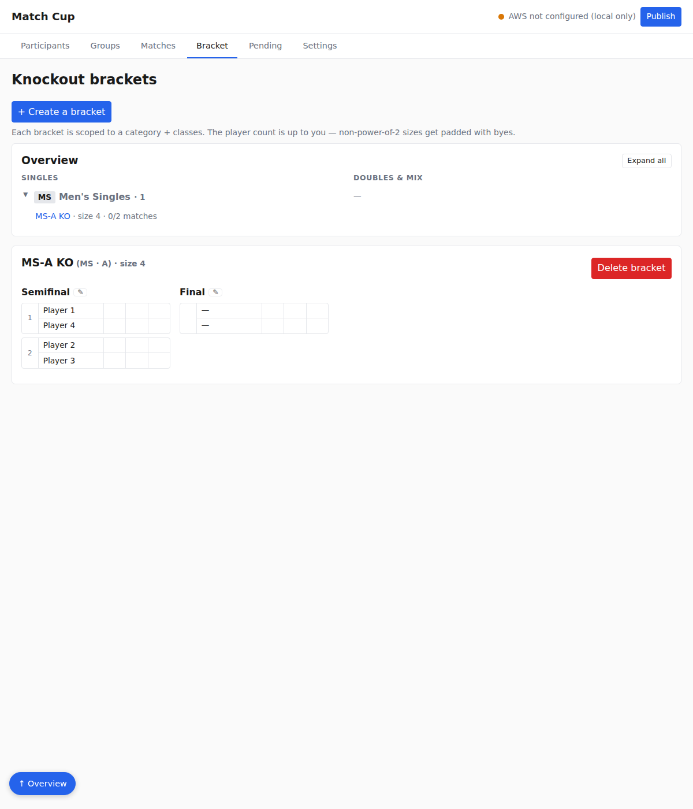
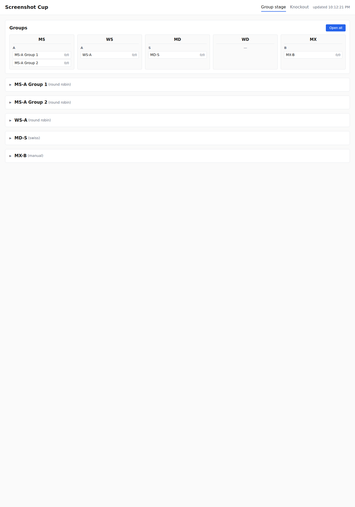
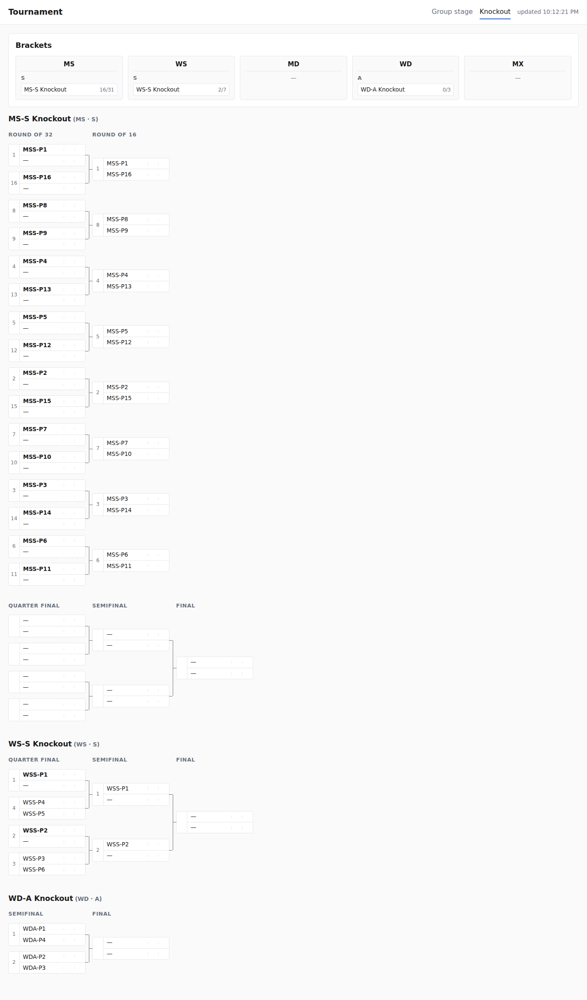

# Features — Tournament Planner

> A walkthrough of every feature in the shipped app, surface by surface, with
> screenshots. This is the "what the operator sees and what it does" companion
> to [Requirements.md](Requirements.md) (the *what it must do*) and
> [API-endpoints.md](API-endpoints.md) (the *how a route behaves*).
>
> Screenshots are generated from a seeded dev server via
> `node scripts/screenshot-views.mjs` and `node scripts/screenshot-matches.mjs`
> (they write to `debug/screenshots/`). Re-run those after any UI change to
> refresh the images below.

## Two surfaces

| Surface | Where | Who | Editable? |
|---|---|---|---|
| **Admin** | `http://localhost:37325` on the director's laptop | Operator | Yes — the source of truth |
| **Result site** | S3 website URL (plain HTTP) | Public spectators | No — read-only |

The admin app owns `admin/data/tournament.json`. On **Publish** it derives view
JSONs and pushes them to S3; spectators see the change on their next refresh.

---

## A. Admin site

A single page with tabbed sections and a persistent header. The header carries
the tournament name, a **status light**, and the **Publish** button.

### Header status light

The dot + label next to **Publish** tells the operator where they stand:

| Light | Meaning |
|---|---|
| 🟢 `Synced N seconds ago` | Last publish succeeded; nothing pending. |
| 🟡 `N change(s) pending` | Edits since the last push — click **Publish**. |
| 🟡 `Pushing…` | A publish is in flight. |
| 🟡 `AWS not configured (local only)` | `TP_BUCKET` unset (dev mode). |
| 🔴 `Push failed — <reason>` | Last push errored; click **Publish** to retry (no auto-retry). |

### A.1 Participants tab

- **Add by form** — name (required), club, category select (`MS/WS/MD/WD/MX`),
  class select (`S/A/B/C/D`), seed.
- **Import CSV** — collapsible panel; paste `name, club, category, class, seed`
  with a header row.
- **List & toolbar** — remove (with confirm), edit fields, mark withdrawn.
- A guardrail blocks adding a participant with no category/class to avoid
  un-groupable rows.

Doubles entries live as a single row (`Alice & Bob`, clubs combined).

### A.2 Groups tab

- **Create group** (collapsible) — pick one category, one or more classes, a
  mode, and a name (auto-suggested). There is also a **Generate groups and
  participants** helper that bulk-creates groups of N players.
- **Delete group** (collapsible) — bulk list of groups to remove.
- **Overview** — a compact tree grouped into *Singles* and *Doubles & Mix*,
  category → class → group, with an **Expand all** toggle. A floating
  **↑ Overview** button jumps back to it.
- **Per-group card** — for each group:
  - **Add/remove members** checklist (scoped by category+class, hides anyone in
    another group; keeps its open/closed state across the per-tick refresh).
  - **Standings table** — rank, P, W, L, sets, points. The leader row is
    highlighted; ordering follows the tiebreaker chain
    (wins → set diff → point diff → head-to-head). Withdrawn players sink to
    the bottom.
  - **Pairings** by round, with editable set-score grids and DONE/LIVE/PENDING
    status badges.
  - **Generate next round** (round-robin / Swiss) and an inline **Add match**
    form (all modes) for `p1 vs p2 · round · court`.

### A.3 Matches tab

The cross-cutting scoring view — every group and bracket match in one place.

- **Live now** — a banner listing in-progress matches (court · players ·
  group · round), so the operator can see what's on court at a glance.
- **Overview** — the same Singles / Doubles & Mix tree as Groups, for jumping.
- **Per-group / per-bracket cards** with matches split into **Pending** and
  **Done** collapsible sections. Each match row has:
  - editable per-set score cells and a court field,
  - **▶** (mark live, stamps `startedAt`), **✓** (mark done, stamps
    `finishedAt`),
  - **WO** (walkover) to award a forfeit to either side.

### A.4 Bracket tab

- **+ Create a bracket** wizard — scope it to a category + classes and a player
  count (any integer ≥ 2). Non-power-of-2 counts are padded to the next power
  of 2 with **BYE**s, which auto-advance.
- **Overview** — brackets listed under their category, e.g.
  `MS-A KO · size 4 · 0/2 matches`.
- **Per-bracket board** — round columns (Round of 32 → … → Semifinal → Final),
  each slot showing both players, an editable score, and a winner pick. Setting
  the winner propagates it into the next round's slot. A 🔗 icon by each round
  name copies a deep link.

### A.5 Pending tab

- Lists **every state change since the last successful publish**, newest first,
  with a server-rendered summary (e.g. *"Score Player 1 vs Player 4 → 2-0"*).
  Summaries are rendered against each entry's pre-mutation snapshot, so even
  deleted/renamed entities show real names.
- **Revert from here** rolls back to the state just before that entry and
  discards every later change (linear undo). **Revert all** restores the
  last-published baseline.
- A successful **Publish** clears the list. This log doubles as both the
  offline queue indicator and the undo journal.

### A.6 Settings tab

- **Rename** the tournament.
- **Publish** diagnostics — a live JSON dump of the publish-status object.
- **Push backup snapshot to S3** — a manual full-`tournament.json` push to the
  non-public `private/backups/` prefix.

---

## B. Result site (spectator, read-only)

Two static pages on S3. Both fetch `data/version.json` once on load, then the
view file they render. **No auto-polling** — the "updated HH:MM" stamp in the
header reflects the last publish; spectators refresh to pull newer data.

### B.1 `index.html` — group stage

- A **Groups** summary band laid out by category (MS / WS / MD / WD / MX), each
  showing its classes and the groups within, with a per-group match-count
  (`done/total`).
- Below, one collapsible block per group. Expanded, each shows the pre-computed
  standings table and the match grid (court, names, set scores, status).
  **Open all** expands every block at once.

### B.2 `knockout.html` — brackets

- A **Brackets** summary band by category, each bracket showing a progress
  count (`16/31`, `2/7`, …).
- Below, each bracket rendered as a column-per-round tree (Round of 32 →
  Round of 16 → Quarter final → Semifinal → Final). Seeds show beside slots,
  winners are bolded, and set scores sit beneath each name. Large brackets
  (5 rounds) use a 2+3 row split so they fit the page width.

---

## C. Cross-cutting behaviors

- **Offline-first.** Edits write to the local JSON immediately; the
  `pendingChanges` counter climbs and the status light goes 🟡. Nothing reaches
  S3 until **Publish**. If Wi-Fi is down, the operator keeps working and
  publishes later — each push is a full snapshot, so there is no per-edit queue
  to replay.
- **Atomic, validated writes.** Every mutation runs through
  `storage.mutate()`: zod-validate → temp file → atomic rename → in-memory
  cache. A crash mid-write can't corrupt the file.
- **Walkovers & withdrawals.** Marking a participant withdrawn fills a walkover
  across all their unfinished matches and KO slots in one action; standings
  credit the win/loss with no set/point delta.
- **Local preview.** During dev the admin app mounts the result site at
  `/view/` and serves the same derived `data/*.json` it would push to S3, so the
  operator can preview the spectator view against live data with no AWS.

## See also

- [Requirements.md](Requirements.md) — the requirements these features satisfy.
- [Storyboard.md](Storyboard.md) — a plain-language, step-by-step walkthrough
  for non-technical readers.
- [API-endpoints.md](API-endpoints.md) — the HTTP routes behind each feature.
- [Architecture.md](Architecture.md) — why the system is shaped this way.
